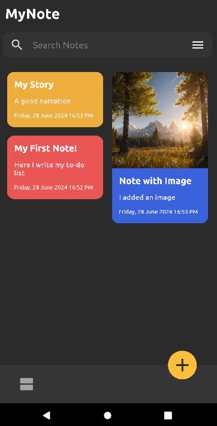
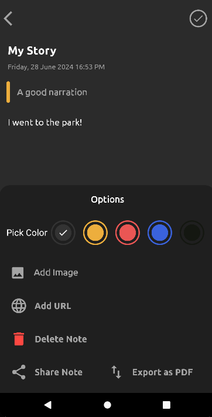

# MyNote - Mobile Note-Taking App

**MyNote** is a powerful, flexible mobile application designed for efficient note-taking, management, and sharing. Tailored to meet the needs of students, professionals, and individuals alike, MyNote offers a streamlined experience to enhance productivity.

## Key Features

- **Note Management**: 
  - Create, edit, and delete text notes with rich content support.
  - Embed multimedia elements (images, links).
  - Notes are tagged with metadata (creation date, last edited).
  
- **PDF Export**: 
  - Export notes as PDF documents for offline use or sharing.
  - Supports rich text formatting in PDFs.

- **Customizable Color Modes**: 
  - Switch between light and dark modes.
  - Customize individual note colors for better organization.

## Technical Specifications

- **Development Environment**: 
  - Built using Android Studio with MVVM (Model-View-ViewModel) architecture for clean code separation.
  
- **Database**: 
  - Room Database used for local data storage (notes, users, and friendships).
  
- **Security**: 
  - User passwords are hashed with BCrypt for secure storage.
  - User sessions managed with tokens, preventing unauthorized access.

## How to Use

1. **Register and Log in**: 
   - Create an account with a secure password.
   - Log in to manage your notes and profile.

2. **Create a Note**: 
   - Use the “New Note” button to create a note. Add a title, rich text, images, or media.
   
3. **Export Notes to PDF**: 
   - After creating or editing a note, export it as a PDF file directly from the app.

4. **Color Mode Customization**: 
   - Switch between dark and light mode in the settings or customize the background color of individual notes.
   
5. **Sharing Notes**: 
   - Add friends through the “Available Users” tab and share notes with them through the “Share” option in the note menu.

## Technologies Used

- **Android Studio**: 
  - Core development platform for coding, debugging, and testing.
  
- **Room Database**: 
  - Manages offline data storage for notes, user profiles, and shared information.

- **BCrypt**: 
  - Handles secure password hashing for user authentication.

- **PdfDocument API**: 
  - Used for generating PDFs from notes with custom formatting.

## Future Enhancements

- **End-to-End Encryption**: 
  - Ensure data is encrypted during sharing and storage.

- **Real-Time Collaboration**: 
  - Allow multiple users to edit notes simultaneously.

- **Advanced PDF Export**: 
  - Add templates and more customization options for exported PDFs.

- **Cloud Integration**: 
  - Sync notes with cloud platforms for seamless access across devices.

- **Notification System**: 
  - Alerts for shared note updates or collaborative edits.

## Screenshots


*Main Activity of the app*


*Creating or editing a note*


*Exporting a note as PDF file*

## Installation and Setup

1. **Clone the Repository**:
    ```bash
    git clone https://github.com/MostafaDawi/MyNote.git
    ```
    
2. **Open in Android Studio**:
    - Import the project into Android Studio and sync the Gradle files.

3. **Run the App**:
    - Use an Android Emulator or physical device to run the app from Android Studio.
